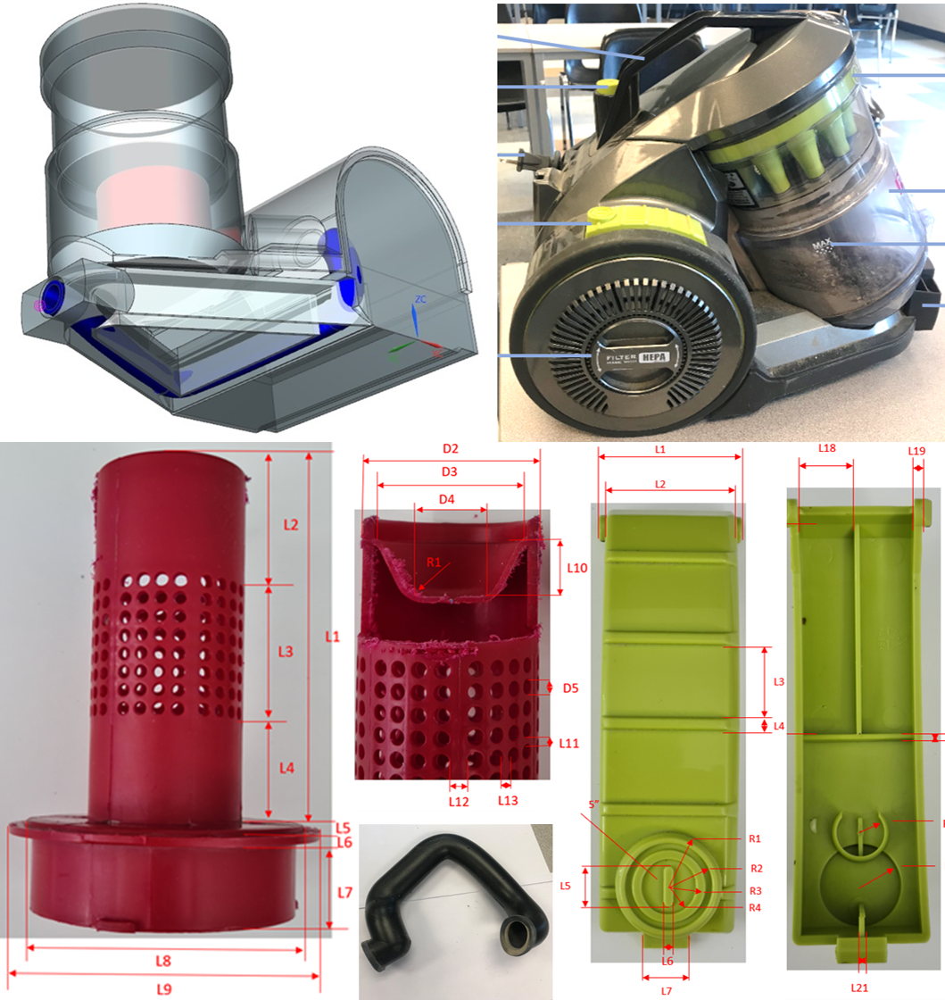

# Projects

- ## Reverse Engineering of Vacuum
### Coursework for Applied Mechanical Design course at Fanshawe College
  
As part of the Advanced Modeling Course in the Applied Mechanical Design Program at Fanshawe College, a comprehensive teardown of a vacuum cleaner was conducted. After calibrating the tools, precise measurements were taken to produce a reverse-engineered CAD model. A detailed teardown report was completed to document the process of recreating the vacuum cleaner through reverse engineering. [Click here](https://github.com/rnmech/Reverse_Engineering.git) to access the 3D model files and the full report.
- ## Modular Potato Planter V2.0
### Project for Applied Mechanical Design course at Fanshawe College  
This project focused on enhancing the original Modular Potato Planter (V1.0) created by a previous cohort. The objective was to incorporate field trial data into the design to optimize its usage and address areas for functionality improvement. Additionally, hoop hose connector was designed to protect the planter from frost, making it more versatile and safe for extended growing seasons.
Click below to view the detailed video of the project.  
  
To explore the final 3D model files, access the full report, and the STL files used for 3D printing prototypes, [click here](https://github.com/rnmech/Fanshawe_AMD_Project.git)
[Link to New Page](Resume.md)
